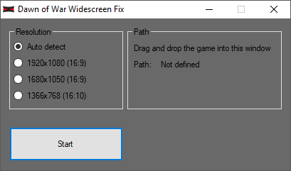

# Dawn of War - Widescreen fix

  <kbd>
    
  </kbd>
  

    <i>
      Preview
    </i>
  

This is an application to enable the aspect ratio of 16/9 or 16/10 for the game "Warhammer 40.000: Dawn of War" & "Warhammer 40.000: Dawn of War – Winter Assault".

#### How to use:
1) Download the program from "release".
2) Start the program.
3) Drag & Drop the game (W40k.exe or W40kWA.exe) into the program.
4) Click on start.

#### Requirements:
   
      - Installed .NET Framework 4
      - A "Warhammer 40.000: Dawn of War" or "Warhammer 40.000: Dawn of War – Winter Assault" installation

#### Issues:
All testing was done using the latest steam version. If you find a bug, please open a new Issue here on GitHub.
